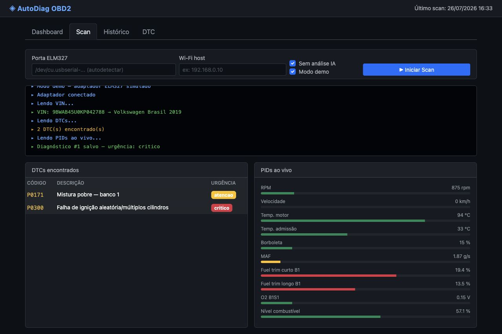

# AutoDiag

*[English version](https://github.com/lucianoon/autodiag/blob/main/README.en.md)*

[](https://pypi.org/project/autodiag/)
[](https://github.com/lucianoon/autodiag/actions/workflows/ci.yml)
[](LICENSE)

Ferramenta de diagnóstico OBD2 em Python para veículos 2015+ usando adaptadores
**ELM327** (USB, Bluetooth serial ou Wi-Fi). Lê códigos de falha (DTCs), coleta
PIDs ao vivo, identifica o veículo pelo VIN, guarda o histórico em SQLite e
oferece uma interface web local com acompanhamento do scan em tempo real.

Não tem um adaptador em mãos? `autodiag scan --demo` executa o fluxo completo
com um veículo simulado — sem hardware nenhum.

## Demo reproduzível



Esta captura foi gerada pela própria aplicação com o cenário determinístico
P0171/P0300. Para reproduzir o mesmo fluxo localmente:

```bash
pip install autodiag
autodiag serve
```

Abra `http://localhost:8000`, entre em **Scan**, marque **Modo demo** e
**Sem análise IA**, e clique em **Iniciar Scan**. Nenhum adaptador, chave de
API ou acesso externo é necessário.

## Evidências rápidas

| Evidência | O que demonstra |
|---|---|
| Publicado no [PyPI](https://pypi.org/project/autodiag/) | Empacotamento e distribuição reais |
| 89 funções de teste | DTCs, PIDs, VIN, histórico, providers e interface web |
| `ruff` + `mypy` + pytest na CI | Qualidade automatizada a cada mudança |
| `autodiag scan --demo` | Fluxo completo reproduzível sem hardware |
| CLI + FastAPI + SSE + SQLite | Produto vertical, não apenas uma chamada de LLM |

## O que ela faz hoje

- **Leitura de DTCs** (modo 03) via ELM327, com decodificação dos códigos
  P/C/B/U e consulta a uma base local com ~65 códigos comuns (descrição em
  português, severidade, sistema e causas prováveis).
- **Limpeza de DTCs** (modo 04), com confirmação.
- **PIDs ao vivo** (modo 01): RPM, velocidade, temperatura do motor e da
  admissão, posição da borboleta, MAF, fuel trim curto/longo B1, tensão da
  sonda O2 B1S1 e nível de combustível.
- **Identificação do veículo**: leitura do VIN (modo 09 02), decodificação
  local (WMI + ano-modelo) e enriquecimento opcional pela API pública da
  NHTSA (vPIC).
- **Heurística de urgência** (`critico` / `atencao` / `informativo`) baseada
  nos DTCs encontrados e em limites de PIDs (superaquecimento, fuel trim alto,
  MAF baixo).
- **Modo demo** (`--demo` na CLI e checkbox na web): adaptador simulado com um
  cenário realista de mistura pobre + falha de ignição (P0171/P0300), para
  testar a ferramenta inteira sem hardware.
- **Análise opcional com IA, com qualquer modelo** — Anthropic nativo
  (streaming + thinking adaptativo) ou qualquer endpoint OpenAI-compatible
  (OpenAI, OpenRouter, Groq, Together, vLLM, Ollama, LM Studio). A escolha é
  por variável de ambiente, sem editar código; `--no-ai` desativa.
- **Histórico local** em SQLite (`~/.autodiag/history.db`) com listagem e
  resumo estatístico (total, críticos, DTCs mais frequentes).
- **Interface web** (FastAPI + uvicorn) com página única e streaming do scan
  via Server-Sent Events, além de API JSON para histórico e consulta de DTCs.

## Arquitetura

```
src/autodiag/
├── cli.py              # CLI (argparse): scan, history, summary, dtc, clear, serve
├── core/
│   ├── dtc.py          # Base local de DTCs (DTCInfo, lookup, severidade)
│   └── vehicle.py      # Decodificação de VIN (local + API NHTSA)
├── elm327/
│   ├── __init__.py     # Protocolo OBDReader + fábrica create_reader (real/simulado)
│   ├── reader.py       # Comunicação ELM327 (serial/Wi-Fi), decodificação de DTCs e PIDs
│   └── sim.py          # Adaptador simulado do modo demo
├── agents/
│   ├── provider.py     # Porta única para LLMs (Anthropic + OpenAI-compatible)
│   └── diagnostic.py   # Prompt de diagnóstico automotivo
├── db/
│   └── history.py      # Histórico de diagnósticos em SQLite
├── ui/
│   └── display.py      # Saída no terminal (rich): tabelas, painéis, status
└── web/
    ├── server.py       # FastAPI: página web, API JSON e stream SSE do scan
    └── static/         # index.html da interface web
```

## Instalação

Direto do [PyPI](https://pypi.org/project/autodiag/) (Python 3.11+):

```bash
pip install autodiag
autodiag scan --demo   # experimente sem hardware
```

Para desenvolver, use [uv](https://docs.astral.sh/uv/):

```bash
git clone https://github.com/lucianoon/autodiag.git
cd autodiag
uv sync
```

Para usar a análise com IA (opcional), copie `.env.example` para `.env` e
configure um modelo (também é lido de `~/.autodiag/.env`). Veja
[Escolhendo o modelo](#escolhendo-o-modelo) — funciona com Anthropic, OpenAI,
OpenRouter, Groq ou um servidor local como Ollama.

## Uso

Com um adaptador ELM327 conectado ao veículo:

```bash
# Diagnóstico completo (detecta a porta automaticamente em macOS/Linux)
uv run autodiag scan

# Porta específica ou adaptador Wi-Fi
uv run autodiag scan --port /dev/cu.usbserial-1410
uv run autodiag scan --wifi 192.168.0.10

# Sem análise de IA
uv run autodiag scan --no-ai

# Apagar DTCs do veículo (pede confirmação)
uv run autodiag clear
```

Sem hardware, ainda funcionam:

```bash
# Fluxo de diagnóstico completo com veículo simulado (P0171 + P0300)
uv run autodiag scan --demo

# Consultar um código na base local
uv run autodiag dtc P0171

# Histórico e estatísticas dos diagnósticos salvos
uv run autodiag history --limit 20
uv run autodiag summary

# Interface web em http://localhost:8000
uv run autodiag serve --open
```

A detecção automática de porta funciona em Windows, Linux e macOS: as portas
seriais do sistema são enumeradas via pyserial e filtradas por identificadores
típicos de adaptadores ELM327 (chipsets CH340/CP210x/FTDI/PL2303 e nomes
"OBDII"). Se o seu adaptador não for reconhecido, informe a porta com
`--port` (ex.: `COM3` no Windows, `/dev/ttyUSB0` no Linux).

## Escolhendo o modelo

O acesso ao LLM tem uma porta única (`agents/provider.py`) com dois backends
atrás da mesma interface, escolhidos por variável de ambiente:

| Variável | Valores |
|---|---|
| `AUTODIAG_LLM_BACKEND` | `auto` (padrão), `anthropic`, `openai` |
| `AUTODIAG_MODEL` | id do modelo; default `claude-opus-5` ou `gpt-4.1-mini` |
| `AUTODIAG_BASE_URL` | endpoint OpenAI-compatible (também aceita `OPENAI_BASE_URL`) |
| `AUTODIAG_API_KEY` | credencial; cai para `OPENAI_API_KEY` / `ANTHROPIC_API_KEY` |

No modo `auto`: chave da Anthropic ⇒ backend `anthropic`; senão, base URL ou
chave OpenAI ⇒ backend `openai`; sem nada, a análise por IA é pulada.

```bash
# Anthropic (backend nativo: streaming + thinking adaptativo)
export ANTHROPIC_API_KEY=sk-ant-...

# OpenAI
export OPENAI_API_KEY=sk-...

# OpenRouter, Groq, Together, DeepInfra, Fireworks…
export AUTODIAG_BASE_URL=https://openrouter.ai/api/v1
export AUTODIAG_API_KEY=sk-or-v1-...
export AUTODIAG_MODEL=meta-llama/llama-3.3-70b-instruct

# Ollama ou LM Studio local — sem credencial nenhuma
export AUTODIAG_BASE_URL=http://localhost:11434/v1
export AUTODIAG_MODEL=llama3.1
```

O backend OpenAI-compatible exige um extra opcional:

```bash
pip install 'autodiag[openai]'
```

Para um scan pontual, `--model` sobrescreve o ambiente:

```bash
uv run autodiag scan --model claude-sonnet-5
```

Servidores locais normalmente não pedem credencial; quando há base URL e
nenhuma chave, o cliente envia um placeholder — o servidor ignora o valor.

## Testes

Os testes cobrem a lógica pura (decodificação de DTCs e PIDs com um reader
falso, VIN, heurística de urgência e histórico com banco temporário) e não
exigem hardware nem chaves de API:

```bash
uv sync
uv run pytest
```

Qualidade de código é verificada com [ruff](https://docs.astral.sh/ruff/)
(lint) e [mypy](https://mypy-lang.org/) (tipos):

```bash
uv run ruff check .
uv run mypy
```

Testes, lint e type-check rodam em CI (GitHub Actions, Ubuntu, Python 3.12)
a cada push e pull request.

## Limitações e segurança

- O diagnóstico é informativo e não substitui inspeção por profissional
  qualificado; a limpeza de DTCs exige confirmação explícita.
- A base local cobre códigos comuns. Códigos específicos de fabricante podem
  exigir documentação ou scanner proprietário.
- O modo demo valida o software, mas não substitui testes com diferentes
  adaptadores ELM327 e veículos reais.
- A análise por LLM é opcional e nunca deve ser usada como única base para uma
  decisão de segurança.

## Licença

[MIT](LICENSE) — © 2026 Luciano de Oliveira Nunes.
